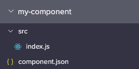

# Coded Components

You can create a highly customized component with Bappo's Coding Tool and use it within the View Editor. 

Below example creates a sample component with a prop `onPress`.

#### 1. Create a Package and select "Component" as the Package Type in the Coding tool

You get `index.js` where you can code your component inside the `createComponent` method and `component.json` where you can define options and props this component can accept.



#### 2. Code the UI of the component in `index.js`

Use the auto-generated template and code your component in the `createComponent` method. Here we just put in a `Button` , which uses `onPress` passed from `props` to handle clicks:  

```text
/**
 * Sample coded component with a prop: onPress
 */

import { Button } from 'bappo-components';
import React from 'react';

const component = {
  createComponent: (options, variables) => {
    return function MyComponent(props) {
      return <Button text="Click Me" onPress={props.onPress} />;
    };
  },
};

export default component;
```

#### 3. Configure the component's `options` and `props`

Open `component.json`and you'll see some options already configured: hide, width, height and spacing: 

* hide: determines visibility based on the kind of the devices
* width and height:  decides the component's width and height
* spacing: the component's margins and paddings

`optionTypes` is the type definition of the option and `defaultOptionConfigs` gives the option a default value. Similarly, `propTypes` defines the props the component can receive and `defaultPropConfigs` gives the prop a default value when component renders in a view.

Difference between options and props:

* options: static values that already defined after designing the when
* props: might contain dynamic values\(e.g. the name of a record from the database\) that can only be determined when the view renders

In this example we declare the component needs a prop `onPress` and the kind is `CALLBACK_FUNCTION`. The `component.json` then becomes:

```text
{
  "label": "My Component",
  "icon": "code",
  "optionTypes": {
    "hide": {
      "type": "BOOLEAN",
      "label": "Hide",
      "canBeDeviceSpecific": true,
      "section": "General"
    },
    "width": {
      "type": "NUMBER",
      "label": "Width",
      "canBeDeviceSpecific": true,
      "section": "Size"
    },
    "height": {
      "type": "NUMBER",
      "label": "Height",
      "canBeDeviceSpecific": true,
      "section": "Size"
    },
    "spacing": {
      "type": "SPACING",
      "label": "Margin/Padding",
      "canBeDeviceSpecific": true,
      "section": "Spacing"
    }
  },
  "defaultOptionConfigs": {
    "hide": {
      "isDeviceSpecific": true,
      "values": {
        "DESKTOP": {
          "configValueKind": "STATIC_BOOLEAN",
          "value": false
        },
        "TABLET": {
          "configValueKind": "STATIC_BOOLEAN",
          "value": false
        },
        "LARGE_PHONE": {
          "configValueKind": "STATIC_BOOLEAN",
          "value": false
        },
        "PHONE": {
          "configValueKind": "STATIC_BOOLEAN",
          "value": false
        }
      }
    },
    "width": {
      "isDeviceSpecific": false,
      "values": {
        "UNIVERSAL": {
          "configValueKind": "STATIC_NUMBER",
          "value": null
        }
      }
    },
    "height": {
      "isDeviceSpecific": false,
      "values": {
        "UNIVERSAL": {
          "configValueKind": "STATIC_NUMBER",
          "value": null
        }
      }
    },
    "spacing": {
      "isDeviceSpecific": false,
      "values": {
        "UNIVERSAL": {
          "configValueKind": "SPACING",
          "marginTop": "none",
          "marginRight": "none",
          "marginLeft": "none",
          "marginBottom": "none",
          "paddingTop": "none",
          "paddingRight": "none",
          "paddingBottom": "none",
          "paddingLeft": "none"
        }
      }
    }
  },
  "propTypes": {
    "onPress": {
      "type": {
        "kind": "CALLBACK_FUNCTION",
        "parameters": {
          "item": {
            "key": "item",
            "label": "Item",
            "description": "The item that will be logged.",
            "type": {
              "kind": "RECORD",
              "objectKey": {
                "referenceKind": "OptionReference",
                "optionName": "objectKey"
              }
            }
          }
        }
      },
      "label": "Click Action Flow",
      "canBeDeviceSpecific": false,
      "section": "General"
    }
  },
  "defaultPropConfigs": {
    "onPress": {
      "configValueKind": "ACTION_FLOW",
      "actionFlowKey": null,
      "inputConfigs": {}
    }
  }
}

```

Save and sync the package.

#### 4. Use the component in View Editor

Go to View Editor and your coded component should appear in the Coded Component section in the left component panel. Drag it to the canvas to use it.


Options and props you declared in `component.json` should appear in the right side panel and ready for you to configure.

